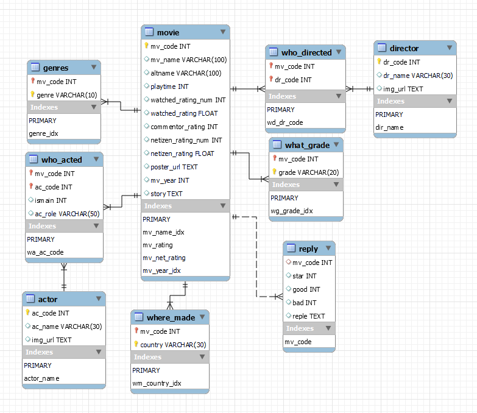
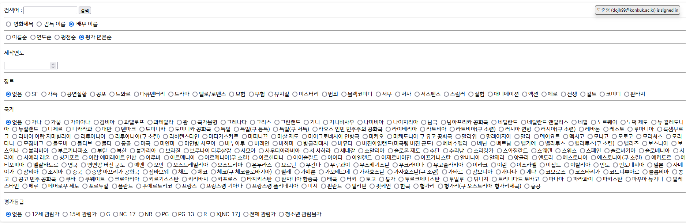

# Database Final project

Code for 2022 Spring Database class final project.

## Task

Crawl movie data from "Naver Movie" service and make simple web interface that can search movies from crawled data.

## Crawling data

Commands for crawl.

```shell
python ./crawl/gethtml.py 10000 300000 10000
python ./crawl/crawl_basic.py 10000 300000 10000
python ./crawl/crawl_detaill.py 10000 300000 10000
python ./crawl/insert.py
```

Before insert data into mysql db, tables should be created in db using `init.sql`.

### Crawling results

- Rows in each table

    |Table Name|# rows|
    |---|---|
    | Movie| 198324 |
    | Actor| 192800 |
    | Director|98538 |
    | Genres|222097 |
    | Reply|97617 |
    | What_grade |78506 |
    | Where_made |222396 |
    | Who_acted |839007 |
    | Who_directed |220665 |

- Total execution of crawling took almost 8 hours under below conditions.
  - 8MB/s speed wifi connection
  - intel i5 11 gen
  - windows 11
  - Realtime virus check by windows defender is turned off.

## Database structure

Following picture is EER diagram of moviedb database.



## Web interface

Simple web interface to search movie from db is included in this project.

- Search page

  

- More search options

  

- Search results

  
  
- Detailed information of Movie

  
  

### Run web interface

To run web interface, you should either set Environment variable or make `.env` file in `web` folder like below.

Before run web interface, make sure that mysql database is properly initialized.

```
SQL_USER=root
SQL_PASSWD=root
SQL_URL=db
SQL_DB=moviedb
```

Use this command to run web interface in root of repository.

```shell
python ./web/flaskr/app.py
```

You can see web interface in web browser with address `localhost:5000`.

### Run web interface with Docker

You can also run web interface by using Docker.

Just use this command at root of repository and wait for every container to run.

```shell
docker-compose up
```

When all containers are running, access web interface using web browser with address `localhost:5000`
